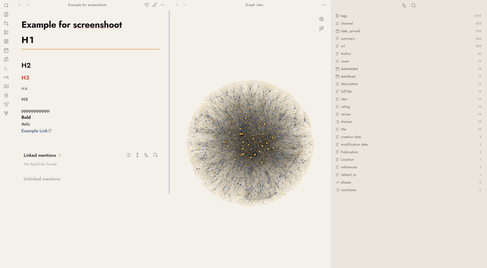
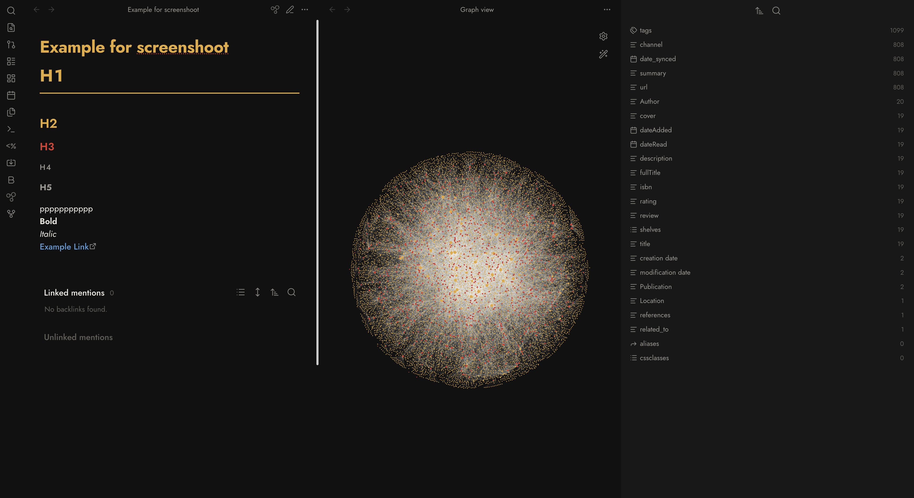
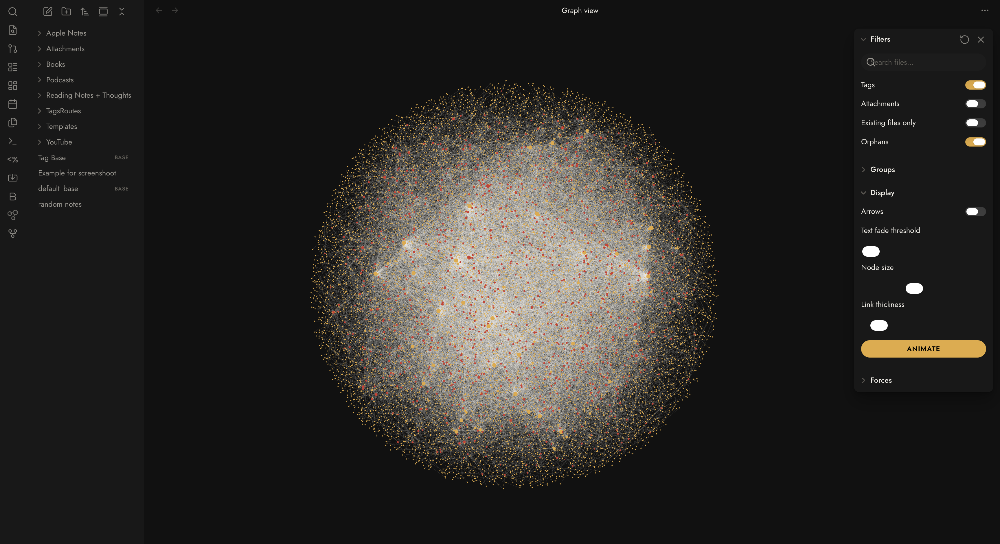

# Bauhaus for Obsidian

A **clean**, **modern**, and **minimalistic** Bauhaus-styled theme for [Obsidian](https://obsidian.md).

## 📸 Showcase

### Light Mode

### Dark Mode

### Graph View
Collaborative and structured visualization.

Inspired by the iconic Bauhaus movement, this theme focuses on geometric precision, primary color accents, and functional design. Built with Material 3 principles, it offers a distraction-free writing environment that is both aesthetically pleasing and highly legible.

## ✨ Key Features

- **Minimalistic Design**: A clutter-free interface that prioritizes your content.
- **Modern Aesthetics**: Leverages Material 3 tonal surfaces and geometric shapes.
- **Bauhaus Palette**: Carefully curated red, blue, and yellow accents that pop without being distracting.
- **Geometric Typography**: Optimised for the **Jost** typeface (a modern homage to Futura).
- **High Contrast**: Excellent legibility in both light and dark modes.
- **Pill-Shaped Components**: Modern UI elements for tags and buttons.
- **Clean Layout**: No harsh borders; depth is created through tonal layering.

## 🛠 Installation

### From Obsidian Community Themes
1. Open Obsidian **Settings**.
2. Go to **Appearance** > **Themes** > **Manage**.
3. Search for **Bauhaus**.
4. Click **Install and Use**.

### Manual Installation
1. Download `theme.css` and `manifest.json`.
2. Create a folder named `Bauhaus` in your vault's `.obsidian/themes/` directory.
3. Move the downloaded files into that folder.
4. Select **Bauhaus** from the Appearance settings.

## 🎨 Recommended Settings

For the best experience, we recommend using the **Jost** font. You can install it from [Google Fonts](https://fonts.google.com/specimen/Jost).

## 📄 License

This theme is released under the [MIT License](LICENSE).

---

*Handcrafted with precision by [mr8lu](https://github.com/mr8lu).*
